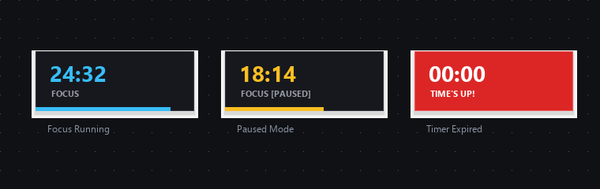

# Perch

A featherweight, borderless Pomodoro HUD and focus timer for Windows, written in Zig.

Perch floats quietly in the corner of your screen—always on top, minimal distraction, zero fluff.



---

## Highlights

- **Floating HUD**: Borderless, topmost overlay that sits right where you want it without stealing focus.
- **Smart States**: Clean progress bar and live countdown; shifts to amber when paused.
- **Visual & Audio Alarm**: When the timer runs out, the HUD flashes red and chimes periodically until acknowledged.
- **Zero Baggage**: No webview, no electron, no frameworks. Pure Win32 GDI calls compiled into a single self-contained binary.

---

## Stats

| Metric | Perch |
| :--- | :--- |
| **Binary Size** | ~24 KB |
| **RAM Usage** | < 2 MB |
| **Startup Time** | < 1 ms |
| **External Dependencies** | Zero (Native Win32 only) |

---

## Controls

| Action | Control |
| :--- | :--- |
| **Pause / Resume** | Left Click |
| **Reset Timer** | Right Click (resets current mode to 25:00 / 05:00) |
| **Toggle Mode** | Middle Click (switches between 25m Focus ↔ 5m Break) |
| **Reposition HUD** | `Shift` + Left Click Drag (drag anywhere across displays) |

---

## Installation

### Prebuilt Binary

Download `perch.exe` or `perch-windows-x86_64.zip` from the [Releases](https://github.com/LeTrollologist/Perch/releases) page and run it. No installer required.

### Building from Source

Requires **Zig 0.13.0+**.

Clone the repository and build:

```bash
git clone https://github.com/LeTrollologist/Perch.git
cd Perch

# Optimized small release build (produces zig-out/bin/perch.exe)
zig build -Doptimize=ReleaseSmall
```

Or build directly via `build-exe`:

```bash
zig build-exe src/main.zig -lc -luser32 -lgdi32 --subsystem windows -O ReleaseSmall -femit-bin=perch.exe
```

---

## License

[MIT](LICENSE) © [LeTrollologist](https://github.com/LeTrollologist)
